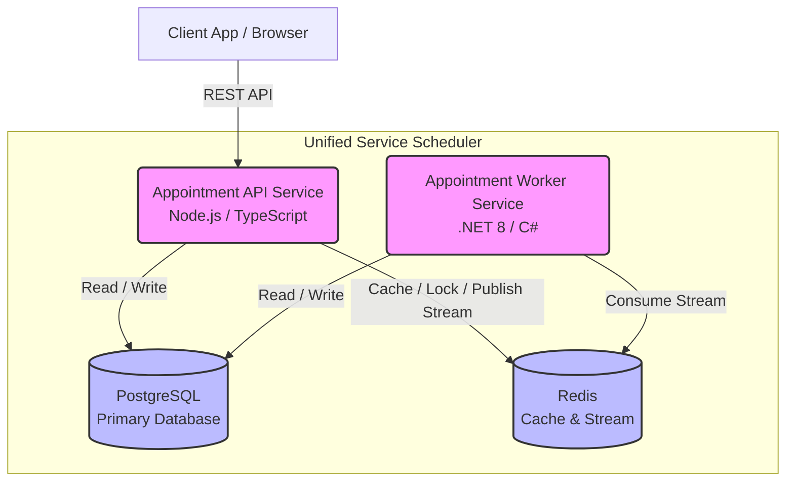

# System Design Document

## 1. Introduction
This System Design Document (SDD) outlines the architecture and implementation details for the **Unified Service Scheduler** (Scenario A), built for the Keyloop Technical Assessment. The system replaces manual booking systems by enabling resource-constrained booking, real-time availability checks, and persistent appointment records for an automotive dealership context.

## 2. System Architecture Diagram

## 3. Component Descriptions

### Appointment API Service (Node.js / TypeScript)
- **Role**: The frontend-facing backend layer that exposes a RESTful API.
- **Responsibilities**: Handles incoming requests for booking appointments, checking real-time availability for Service Bays and Technicians, and querying schedules.
- **Design Pattern**: Hexagonal Architecture (Ports and Adapters). It handles input validation, executes core domain use cases, and delegates persistence/messaging to infrastructure adapters.

### Appointment Worker Service (.NET / C#)
- **Role**: The background asynchronous processing engine.
- **Responsibilities**: Consumes events from the API service (e.g., via partitioned Redis streams) to execute background tasks. This includes auto-assigning technicians, processing audit logs, sending daily appointment reminders, and handling long-running or retryable operations without blocking the API.
- **Design Pattern**: Hexagonal Architecture utilizing the .NET Generic Host (`BackgroundService`).

### PostgreSQL
- **Role**: Primary persistent data store.
- **Responsibilities**: Maintains the ultimate source of truth for highly relational data including Appointments, Customers, Technicians, Service Bays, and Audit Logs. 

### Redis
- **Role**: In-memory data structure store used for transient state and inter-service communication.
- **Responsibilities**: 
  1. **Distributed Locking**: Manages temporary slot holds during the booking process to prevent double-booking.
  2. **Caching**: Caches frequent read-heavy API responses to reduce PostgreSQL load.
  3. **Event Streaming**: Uses Redis Streams to decouple the API Service from the Worker Service, enabling asynchronous event-driven workflows.

## 4. Data Flow

### Booking an Appointment (Real-Time Availability & Confirmation)
1. **Request**: The client sends a `POST /appointments` request with desired time, service type, and vehicle data.
2. **Availability & Lock**: The API Service checks PostgreSQL for existing overlapping appointments. Concurrently, it acquires a temporary distributed lock in **Redis** for the specific Service Bay and Technician to ensure thread-safe booking in highly concurrent environments.
3. **Persistence**: Once availability is confirmed, the API Service creates the `Appointment` record in **PostgreSQL**.
4. **Release & Publish**: The API Service releases the Redis lock and publishes an `AppointmentCreated` event to a **Redis Stream**.
5. **Asynchronous Processing**: The API immediately responds `201 Created` to the client. In the background, the **Appointment Worker Service** consumes the `AppointmentCreated` event from the Redis Stream, registers the audit log, and queues any necessary automated communications.

## 5. Chosen Technologies and Justifications

| Technology | Justification |
| :--- | :--- |
| **Node.js & TypeScript** | Perfect for the API layer due to its non-blocking I/O, rapid development ecosystem (Express), and strong static typing for reliable refactoring. |
| **.NET 8 & C#** | Selected for the worker service due to its enterprise-grade background processing (`IHostedService`), robust multi-threading, and excellent ecosystem for stream processing. Demonstrates a polyglot microservice architecture. |
| **PostgreSQL** | A mature, ACID-compliant relational database. Crucial for the complex relational queries required to map Technicians, Service Bays, Customers, and Appointments reliably. |
| **Redis** | Chosen for its versatility. It fulfills three critical architectural needs simultaneously: distributed locking (Redlock pattern), high-speed caching, and event streaming (Redis Streams). |
| **Docker & Compose** | Ensures consistent environments across development and testing. `docker-compose.yml` provides a one-click local setup for the API, Worker, Redis, and Postgres. |

## 6. Observability Strategy

To ensure the system remains reliable, scalable, and maintainable, the following observability strategy is implemented:

- **Structured Logging**: Both the API (using a logger like Pino or Winston) and the Worker service (using .NET ILogger/Serilog) output structured JSON logs. Correlation IDs are generated at the API gateway and passed through HTTP headers and Redis stream message payloads to trace a single business action across both microservices.
- **Metrics (RED Method)**:
  - **API Service**: Tracks Request Rate, Error Rate, and Duration using Prometheus middleware.
  - **Worker Service**: Tracks stream consumer lag, message processing duration, and dead-letter queue (DLQ) counts to ensure background tasks are not bottlenecking.
- **Health Checks**: Implemented in `docker-compose` to monitor the liveness and readiness of Postgres, Redis, and both application services, allowing container orchestrators to self-heal.

## 7. AI Collaboration Narrative

### Strategy & Process
This project was built using an Agentic AI workflow (Google Antigravity / OpenCode). The high-level strategy for directing the AI involved a **Spec-Driven Development** approach:
1. **Research & Planning**: Before writing any code, the AI was directed to create detailed markdown specifications (e.g., `data-model.md`, `research.md`, `plan.md`) for each feature.
2. **Review & Refine**: I manually reviewed the AI's proposed architecture, data models, and Hexagonal design structures. If the AI misunderstood a requirement (such as how to handle multi-tenancy or Redis stream consumer groups), I provided specific constraints and asked it to regenerate the plan.
3. **Execution via Tasks**: Once a plan was approved, the AI generated a `tasks.md` checklist. I instructed the AI to implement the feature strictly task-by-task.
4. **Test-Driven Verification**: A strict TDD approach was enforced. The AI was required to write Unit and Integration Tests *first*, run them to prove they failed, implement the feature, and then iterate until all tests passed with zero errors.

### Ensuring Final Code Quality
By maintaining Hexagonal Architecture, the core domain logic remained pure and easily testable. When the AI struggled with complex integration testing setups (such as configuring Testcontainers for PostgreSQL or resolving EF Core casing issues with raw SQL views), I provided explicit guidance and documentation context to help the agent debug the sandbox environment. This collaborative ping-pong ensured that the final codebase was not only generated rapidly but was also structurally sound, fully covered by tests, and deeply understood.
